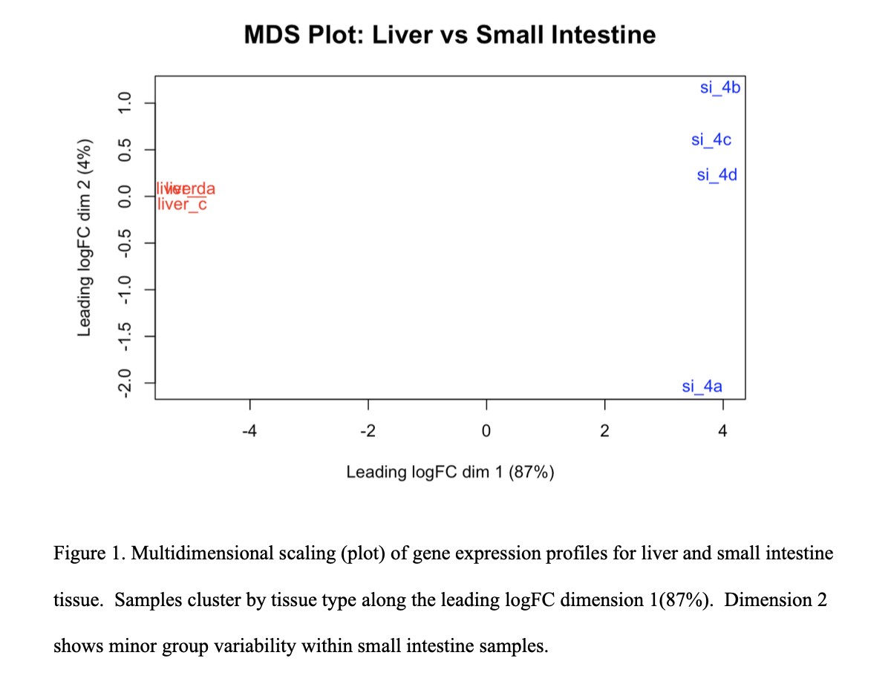
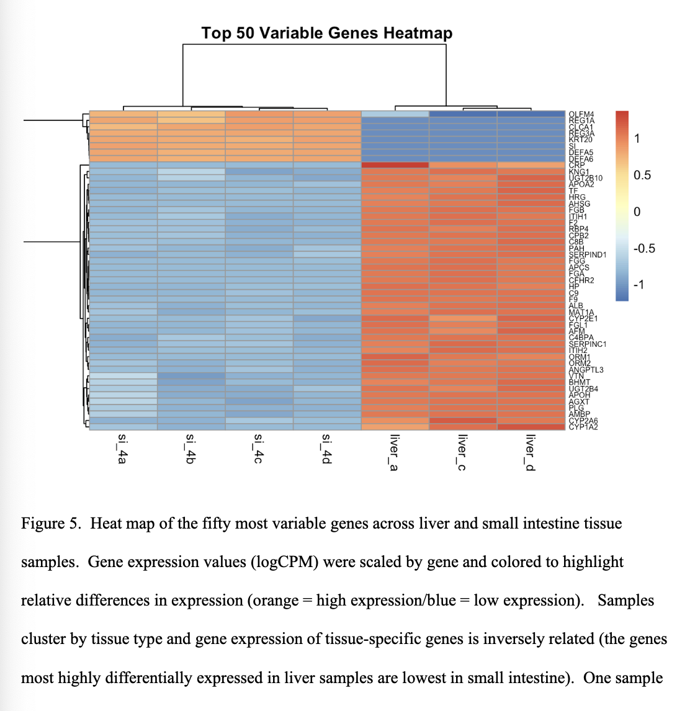

# RNA-seq Differential Expression Analysis of Healthy Liver and Small Intestine Tissue

## Project Overview

This project analyzed RNA-seq data from healthy human liver and small intestine tissue to identify tissue-specific patterns of gene expression and biological pathways.

The analysis was performed using a standard RNA-seq workflow including quality control, read trimming, alignment, gene quantification, differential expression analysis, visualization, and functional enrichment.

## Biological Question

How do baseline transcriptomic profiles differ between healthy liver and small intestine tissue, and what biological pathways characterize each tissue?

## Workflow

1. Quality assessment with FastQC
2. Adapter and quality trimming with Trim Galore
3. Alignment to the human reference genome (GRCh38) using STAR
4. Gene quantification with HTSeq-count
5. Differential expression analysis using edgeR in R
6. Functional enrichment analysis using Gene Ontology (GO) and KEGG pathways
7. Visualization of results using heatmaps, MDS plots, BCV plots, and smear plots

## Tools Used

- FastQC
- Trim Galore
- Cutadapt
- STAR
- HTSeq-count
- RStudio
- edgeR
- limma
- pheatmap
- Enrichr
- Gene Ontology (GO)
- KEGG

## Code

The `scripts/` folder contains an R Markdown workflow for the liver vs small intestine differential expression analysis using edgeR.

Main script:

- `scripts/edgeR_liver_small_intestine_workflow.Rmd`

## Key Results

- Identified 11,300 significantly differentially expressed genes (FDR < 0.05)
- 5,189 genes were upregulated in liver tissue
- 6,111 genes were upregulated in small intestine tissue
- Liver tissue showed enrichment for coagulation and complement pathways
- Small intestine tissue showed enrichment for mucosal defense and antimicrobial response pathways

## Example Results

### Multidimensional Scaling (MDS) Plot

The MDS plot demonstrates clear separation between liver and small intestine samples based on global gene expression patterns.

### Differential Expression Heatmap

The heatmap highlights patterns of gene expression that distinguish liver and small intestine tissue samples.

## Biological Interpretation

The results demonstrate strong tissue-specific gene expression patterns that reflect the specialized biological functions of the liver and small intestine.

Liver tissue showed enrichment of pathways involved in coagulation, complement activation, and metabolic processing, while small intestine tissue showed enrichment of genes involved in immune defense, antimicrobial activity, and barrier function.

These baseline transcriptomic profiles provide a framework for understanding how these tissues may respond to environmental contaminants such as microplastics.

## Skills Demonstrated

- RNA-seq analysis
- Differential gene expression analysis
- Functional enrichment analysis
- Statistical analysis in R
- Data visualization
- Biological interpretation
- High-performance computing workflows

## Author

Jill E. Lynch  
University of Delaware  
Graduate Certificate in Bioinformatics & Data Science

## Repository Contents

- Project report
- Project documentation
- Analysis summary
